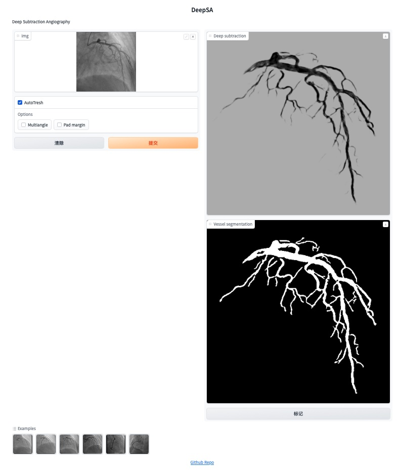

# Deep Subtraction Angiography
## Overview
Pretrained Subtraction and Segmentation Model for Coronary Angiograms

## Online demo
http://116.63.137.34:7860


## Install 
```shell
conda create --name deepsa python==3.9
conda activate deepsa
git clone https://github.com/newfyu/DeepSA.git
cd DeepSA
pip install -r requirements.txt
```


## Dataset
- LM-CAD (Live-Mask Coronary Angiogram Dataset): [google driver](https://drive.google.com/drive/folders/1fEKPNMcRv5qb8vKyaJzF1P9V9ZavA1xL)
- FS-CAD (Fine Segmentation Coronary Angiogram Dataset): [google driver](https://drive.google.com/drive/folders/1fEKPNMcRv5qb8vKyaJzF1P9V9ZavA1xL)

Create a "datasets" folder in the root directory, and then extract the dataset and place it in the folder.

## Train
Train pretrained model use LM-CAD dataset
```shell
python train.py --name xxxx
```

## Finetune
Finetune pretrained mode use FM-CAD dataset
```
python finetune.py --name xxxx
```

## Run demo
```
python demo.py
```
